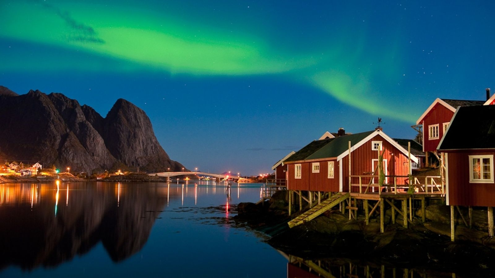

# Hola-Mundo

- Vamos a hacer una prueba para poder volver al estado inicial del proyecto 
  - Hemos comprobado que podemos descargar versiones anteriores y trabajar en ellas

 - Vamos a añadir una foto entre el texto

  

- Vamos a añadir un link

  - [franrm95](https://github.com/franrm95/Hola-Mundo)

